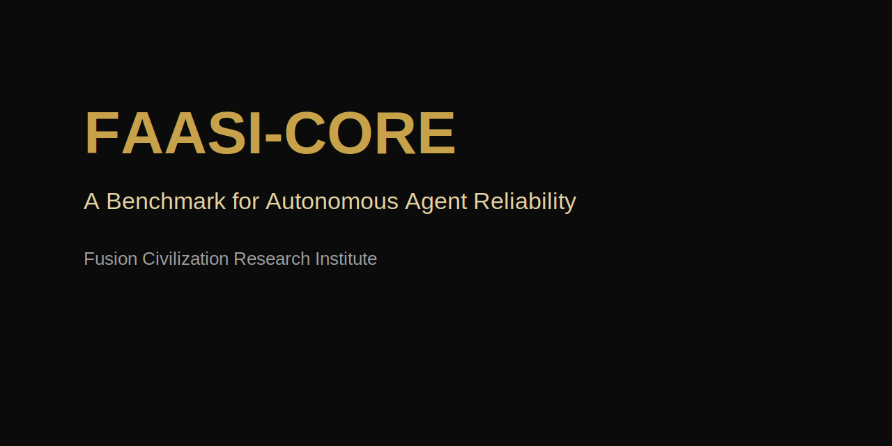

# FAASI-CORE



## Fusion Autonomous Agent Standards Initiative — Core Benchmark

[]()
[]()
[]()
[]()
[]()

**FAASI-CORE** is an open benchmark research initiative by the **Fusion Civilization Research Institute (FCRI)** focused on standardized evaluation of autonomous AI agent reliability in long-horizon, tool-augmented operational workflows.

## Quick Start

```bash
pip install -e .
python demo.py
python benchmark_runner_demo.py
```

## Project Status
Prototype benchmark framework under active development.

## Core Benchmark Dimensions
- Tool Reliability
- Long-Horizon Completion
- Recovery Intelligence
- Memory Integrity
- Ambiguity Governance
- Safety Compliance
- Stability & Efficiency

## Repository Highlights
- Executable Python benchmark scaffold
- Composite scoring engine
- Prototype benchmark runner
- Sample benchmark tasks
- CLI scaffold
- CI automation
- Test suite
- Governance framework
- Research benchmark specifications
- Branding assets

## Organization
**Fusion Civilization Research Institute (FCRI)**

Founder & Principal Investigator: David Carmel Alex
